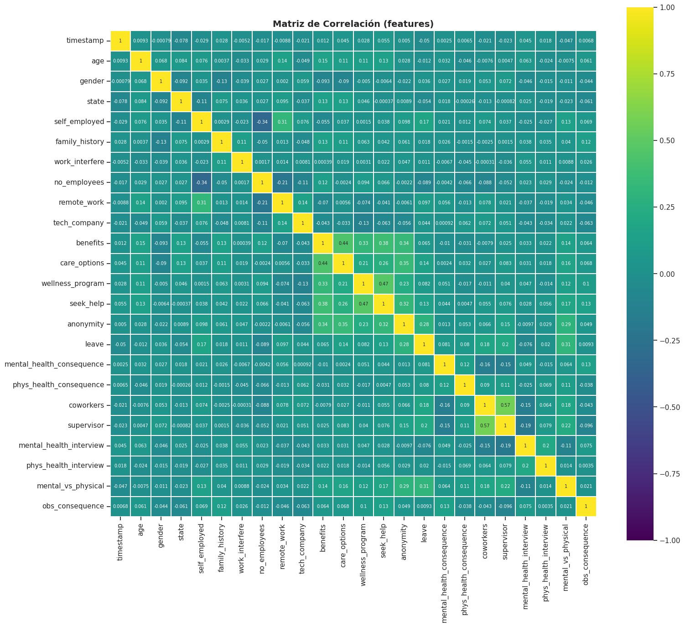
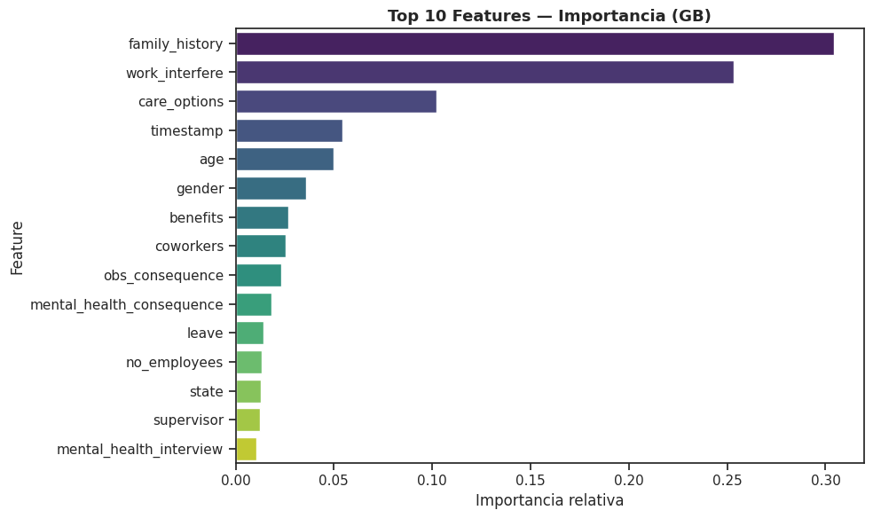
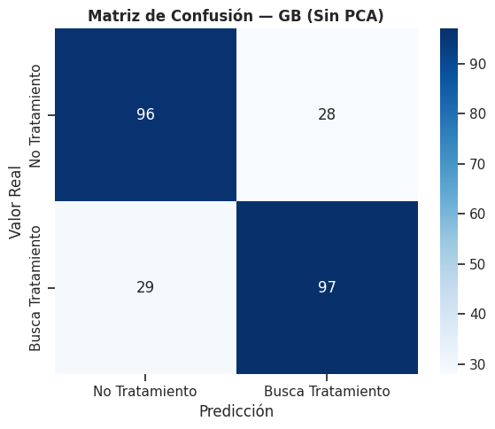
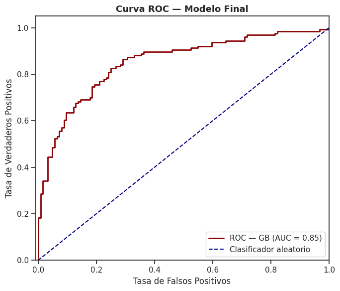

# Mental Health Treatment-Seeking Prediction

Predicting whether a person working in tech is likely to seek mental health treatment, based on the **OSMI Mental Health in Tech Survey**.

**Authors:** Michael Steven Lamprea Vera & Jeyson Carmona Bedoya

---

## Objective

Build and compare multiple machine learning classifiers to predict the `treatment` variable (renamed to `Target`) — whether a survey respondent has sought treatment for a mental health condition — using workplace, demographic, and attitudinal features from the survey.

## Dataset

- **Source:** [OSMI Mental Health in Tech Survey](https://www.kaggle.com/datasets/osmi/mental-health-in-tech-survey) (Kaggle)
- ~1,250 survey responses, 27 original features (demographics, company policies, and personal attitudes toward mental health in the workplace)
- **Target:** `treatment` → `Target` (0 = does not seek treatment, 1 = seeks treatment) — a near-perfectly balanced binary target

##  Pipeline

```
Load → Cleaning → EDA → Feature Selection → Modeling → Evaluation (with & without PCA)
```

1. **Data cleaning** — column names normalized, free-text `gender` values consolidated into `male` / `female` / `other`, and `age` filtered to a valid 18–65 range.
2. **EDA** — null-value analysis, target/feature distributions, a full correlation matrix, a Spearman correlation ranking against the target, pairplots, and box plots of key variables.
3. **Encoding** — categorical variables transformed with `LabelEncoder`; nulls imputed using the mode (or `"No Comment"` for free-text fields).
4. **Train/test split** — 80/20, stratified on the target; only the continuous `age` feature is scaled.
5. **Modeling** — 9 classifiers tuned with `GridSearchCV` (5-fold stratified CV, optimizing weighted F1-score): Decision Tree, Random Forest, Extra Trees, Gradient Boosting, KNN, SGD Classifier, Logistic Regression, MLP, and SVC.
6. **Dimensionality reduction** — PCA (96% explained variance retained) applied as an alternative pipeline, and the two approaches (with/without PCA) are compared head-to-head.
7. **Final evaluation** — feature importance, confusion matrix, and ROC curve for the winning model.

##  Results

**Best model (without PCA): Gradient Boosting**

| Metric | Score |
|---|---|
| Accuracy | 0.772 |
| F1 Score (weighted) | 0.772 |
| ROC AUC | 0.851 |

The full test-set comparison across all 9 models, without PCA:

| Model | Accuracy | F1 Score |
|---|---|---|
| **Gradient Boosting** | **0.772** | **0.772** |
| Extra Trees | 0.760 | 0.760 |
| Random Forest | 0.752 | 0.752 |
| Decision Tree | 0.708 | 0.707 |
| KNN | 0.532 | 0.532 |
| SGD Classifier | 0.504 | 0.338 |
| Logistic Regression | 0.504 | 0.338 |
| MLP | 0.496 | 0.329 |
| SVC | 0.496 | 0.329 |

### Key finding: PCA helps some models and hurts others

Tree-based models (Gradient Boosting, Extra Trees, Random Forest, Decision Tree) consistently performed *worse* with PCA, while linear/distance-based models (SVC, Logistic Regression, SGD, MLP, KNN) saw large F1 gains — in some cases over +0.35. This makes sense: tree ensembles already handle feature interactions and irrelevant dimensions natively, so compressing the feature space mostly destroys useful signal for them, whereas it helps models that are sensitive to feature scale and redundancy.

### What drives the prediction?

The three strongest predictors of `Target` (by Gradient Boosting feature importance) are, in order:
1. **`family_history`** — family history of mental illness
2. **`work_interfere`** — whether mental health interferes with work
3. **`care_options`** — awareness of employer-provided mental health care options

##  Key Visualizations

| | |
|---|---|
| **Correlation Matrix** — relationships between all numerical features | **Feature Importance** — top predictors for the winning model |
|  |  |
| **Confusion Matrix** — Gradient Boosting, test set | **ROC Curve** — final model, AUC = 0.85 |
|  |  |

> **Note:** these chart images were exported directly from the notebook's last run, so their titles/axis labels are still in Spanish. Re-running the notebook end-to-end (e.g., on Kaggle) will regenerate them with the translated English labels — see *Notes* below.

##  Tech Stack

`Python` · `pandas` · `numpy` · `scikit-learn` · `seaborn` · `matplotlib` · `kagglehub`

## Running the Project

This notebook downloads the dataset automatically via `kagglehub`, so the easiest way to run it is directly on Kaggle:

1. Upload the notebook to Kaggle (or open it in a new Kaggle Notebook).
2. Run all cells — the dataset will be pulled automatically.

To run locally:

```bash
pip install category_encoders skrebate boruta matplotlib seaborn scikit-learn pandas numpy kagglehub
jupyter notebook mental_health_treatment_prediction.ipynb
```

##  Suggested Repository Structure

```
mental-health-treatment-prediction/
├── README.md
├── mental_health_treatment_prediction.ipynb
└── images/
    ├── correlation_heatmap.png
    ├── feature_importance.png
    ├── confusion_matrix_best_model.png
    └── roc_curve.png
```

##  Notes

- The notebook text (markdown explanations, code comments, print statements, and plot titles/labels) has been fully translated to English. Variable and function names were intentionally left as-is to avoid introducing bugs.
- Because the dataset can only be fetched through `kagglehub`/Kaggle, the chart images above are the ones already generated in the original (Spanish) run. Running the translated notebook end-to-end on Kaggle will regenerate all charts with English titles/labels — re-export them afterward to refresh the `images/` folder.

##  Acknowledgments

Dataset provided by the [Open Sourcing Mental Illness (OSMI)](https://osmihelp.org/) organization via Kaggle.
